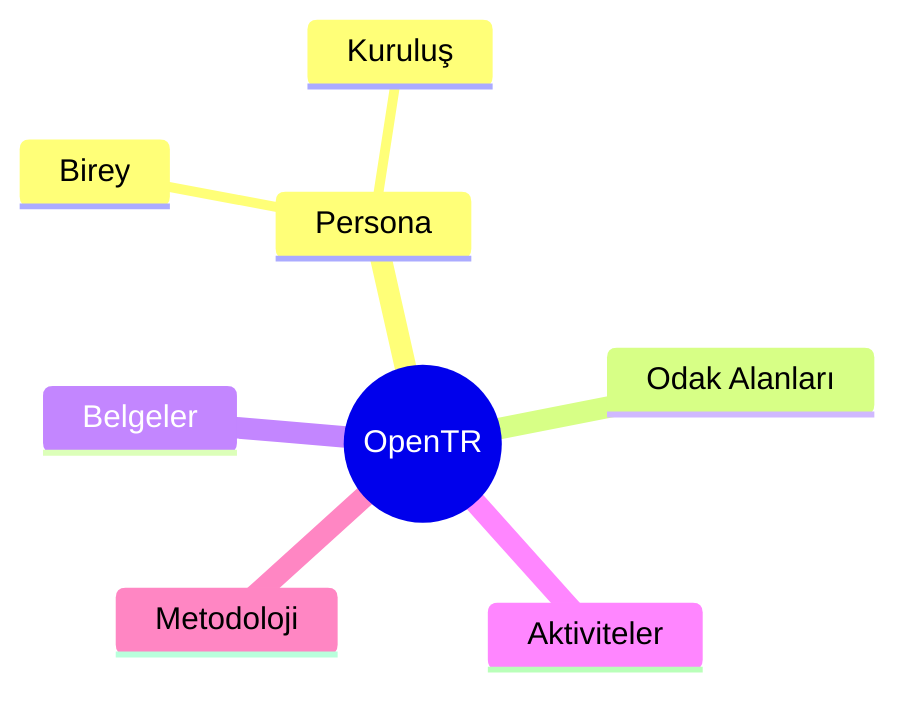
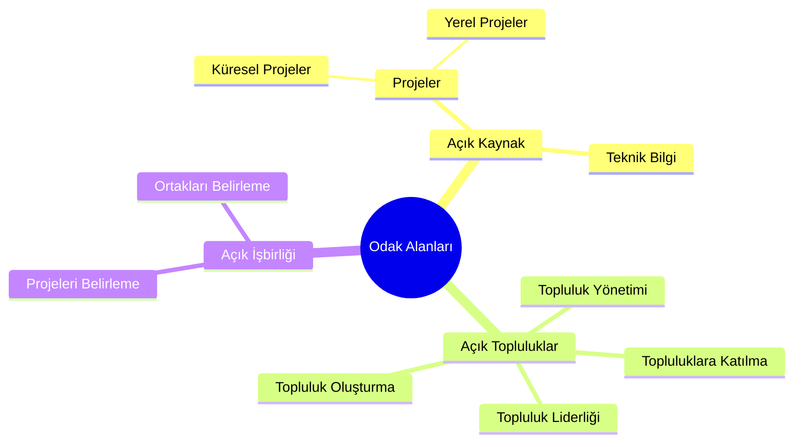
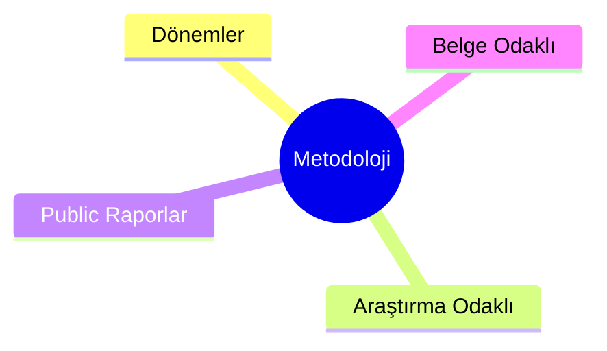
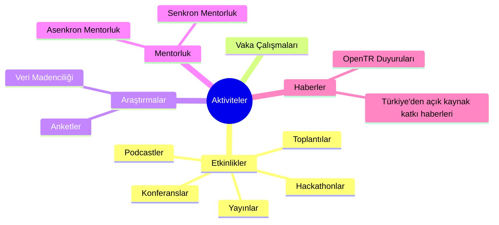
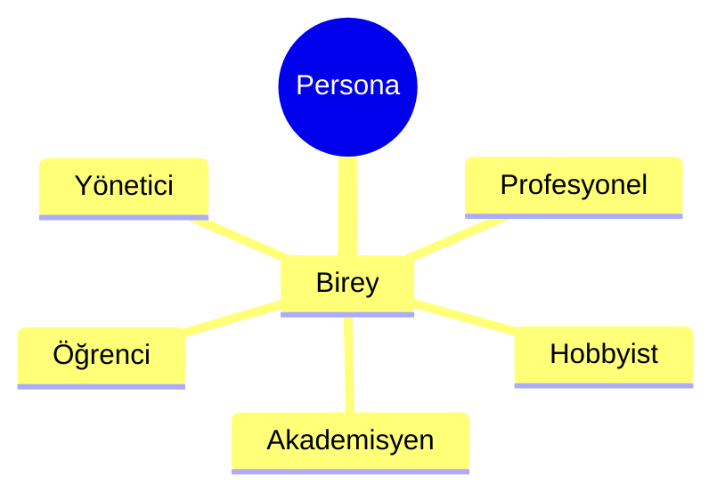
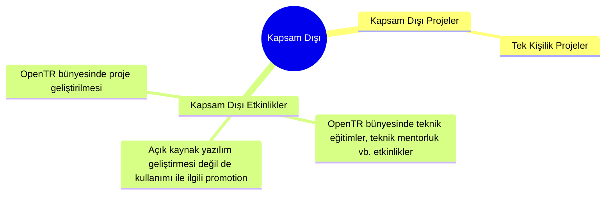

### Strateji

OpenTR, Türkiye'de açık kaynak yazılıma ve beraberindekilere hem yatırım hem de katkı yapmayı artıracak bir oluşumdur.

Bu oluşum için belirlenen strateji, vizyon ve misyon aşağıda açıklanmıştır.

Özet olarak, odak alanlarımız üzerinde metodolojik ve time-boxed dönemler şeklinde çalışmalar yapılacaktır.

OpenTR'nin metodolojisi [Metodoloji](../methodology/) belgesinde açıklanmıştır.

### Vizyon
OpenTR olarak, açık kaynak ve beraberindekilerin Türkiye'de gelişimi destekleme, işbirliğini artırma ve olumlu sosyal etki yaratma gücünü ciddiye alıyoruz.

Türkiye’de yazılım geliştirme ve teknoloji alanında teknik yeterliliği olan çok sayıda kuruluş ve birey olsa da, bu kuruluş ve bireylerin açık kaynak projeleri ve toplulukları ile ilgili çalışmaları ve katkıları çok sınırlıdır. Bu çalışmaları artırmak, Türkiye’nin teknoloji alanında daha da gelişmesini ve uluslararası alanda daha fazla görünür olmasını sağlayacaktır.

Doğrudan OpenTR çalışmaları ile birebir orantılı olmasa da, uzun vadede yukarıda bahsedilen kazanımların yazılım ekosistemimizde elde edilmesi, uluslararası alanda Türkiye’nin teknoloji alanında daha fazla söz sahibi olması, daha fazla yatırım alması, elindeki insan kaynağını daha iyi değerlendirmesi ve daha fazla istihdam yaratması sonuçlarını doğuracaktır.

### Misyon

Bu vizyon doğrultusunda, Türkiye'de açık kaynak ve beraberindekilerin gelişimini desteklemek için çalışmalar yapıyoruz.
OpenTR, kuruluşlar ve bireyler için ücretsiz ve bağımsız olarak belgeler, veri, rehberlik ve strateji sağlamaktadır.

OpenTR olarak inovasyonun açık kaynak projelerde olduğuna inanıyoruz. Bu projelere katkıda bulunmak ve hatta liderlik yapmak, Türkiye’nin inovasyon know-how’ını artıracaktır.

Ayrıca, ülkemizdeki açık kaynak katkı yapan sayısı henüz çok fazla olmadığı ve çok sayıda yeni başlayanın olacağı göz önüne alındığında, açık toplulukların yeni başlayanları ve her ülkeden farklı profillerdeki katılımcıları kabul etmesi, bu bireylerin ve kuruluşların başlangıçlarını kolay yapmasını sağlayacaktır.

OpenTR olarak Türkiye yazılım ekosistemini geliştirecek diğer oluşumlara, kapalı projelere veya kapalı topluluklara karşı olmamakla birlikte, bunları çalışma kapsamımıza almıyoruz.

### Odak Alanlarımız

#### Açık Kaynak
Açık kaynak teknolojileri, Türkiye'de teknoloji geliştirme kültürünün yaygınlaşmasını sağlayacak bir araçtır. Açık kaynak teknolojilere katkı yaparak Türkiye'de mühendisliğin, inovasyonun ve yaratıcılığın ilerlemesini hedeflemekteyiz. OpenTR, Türk kuruluşları ve bireylerin açık kaynak projelerine katkıda bulunmalarını teşvik eder ve bu projelere katkı sağlamalarına yardımcı olacak kaynaklar sağlayacaktır.

#### Açık Topluluk
Açık topluluklar, katılımcıların birbirleriyle işbirliği yaparak birlikte çalıştıkları, birbirlerinden öğrendikleri ve birbirlerini destekledikleri yerlerdir. Açık kaynak teknolojilerindeki gelişmelerin ve yeniliklerin çoğu açık topluluklar tarafından gerçekleştirilir. OpenTR olarak açık toplulukların oluşma ve yürütme modelleri hakkında rehberlik kaynakları sunarak bu topluluklarda yer alan ve hatta liderlik yapan Türk kuruluş ve şahısların sayısını artırmayı hedeflemekteyiz.

#### Açık İşbirliği
Açık teknoloji ve açık topluluk kavramları nasıl sorusunun cevabını verse de, şirketlerin ve bireylerin Türk teknoloji ekosistemine faydası için Türkiye özelinde işbirliğini artırmasını bu odak alanındaki çalışmalarımız ile hedeflemekeyiz. Stratejik olarak şirketlerin ve bireylerin hangi proje ve topluluklarda beraber çalışabileceğini belirlemek ve bu işbirliklerini desteklemek, OpenTR'nin bu odak alanındaki çalışmalarının temelini oluşturmaktadır.

### Çıktılar

OpenTR olarak, aşağıdaki çıktıları sağlamayı hedeflemekteyiz:

- Türkiye'de açık kaynak durum analizi
- Kuruluşlar için açık kaynak strateji belgeleri
- Bireyler için açık kaynak rehberlik belgeleri
- Vaka çalışmaları
- Açık işbirliğini katalize eden kuruluşlar ve bireyler için rehberlik belgeleri
- Açık kaynak ile ilgili tanımlar, kavramlar ve terminoloji ile ilgili Türkçe kaynaklar
- Açık kaynağa katkı için mentorluk programları

### OpenTR Mindmap



<hr class="my-5">

### Odak alanları



<hr class="my-5">

### Araştırma

```mermaid
mindmap
((Araştırmalar))
  Sektör Araştırması
    ::icon(fa fa-industry)
      Anketler
      ::icon(fa fa-clipboard-list)
        Analizler
        ::icon(fa fa-magnifying-glass-chart)
  Literatür Taraması
  ::icon(fa fa-file-lines)
    ABD Politikaları Taraması
    ::icon(fa fa-file-lines)
    AB Politikaları Taraması
    ::icon(fa fa-file-lines)
    TR Politikaları Taraması
    ::icon(fa fa-file-lines)
    Benzer Girişimler
    ::icon(fa fa-file-lines)
  ```

<hr class="my-5">

### Belgeler

```mermaid
mindmap
((Belgeler))
    Başlangıç Rehberleri
    ::icon(fa fa-book-open)
      Persona
      ::icon(fa fa-user)
    Tanımlar
      ::icon(fa fa-book-open)
      Açık XYZ Nedir?
      ::icon(fa fa-question-circle)
      Lisans Tipleri
      ::icon(fa fa-file-alt)
      Katkı Nedir?
      ::icon(fa fa-hands-helping)
    Strateji Belgeleri
    ::icon(fa fa-bullseye)
      Persona
      ::icon(fa fa-user)
      Hedefler
      ::icon(fa fa-bullseye)
    Raporlar
    ::icon(fa fa-file-lines)
    Neden?
    ::icon(fa fa-question-circle)
    Nasıl?
    ::icon(fa fa-question-circle)
    Engeller
    ::icon(fa fa-question-circle)
    Vaka Çalışmaları
    ::icon(fa fa-project-diagram)
      Birey
      ::icon(fa fa-user)
      Kuruluş
      ::icon(fa fa-building)
```

<hr class="my-5">

### Metodoloji



<hr class="my-5">

### Aktiviteler



<hr class="my-5">

### Persona



<hr class="my-5">

### Kapsam Dışı


