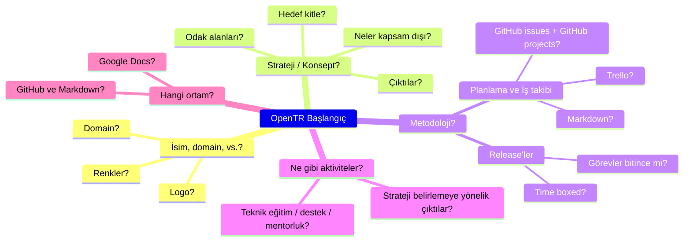

---
title: "2023 yılı 1. Çalışma Dönemi"
linkTitle: "2023 1. Dönem"
weight: 1
description: >
  [Nisan 2023 - Haziran 2023]
---

Bu dönemde OpenTR'nin ilk adımları atılacaktır. OpenTR, Türkiye'de açık kaynak yazılıma ve beraberindekilere hem yatırım hem de katkı yapmayı artıracak bir oluşum olacaktır.

Bu dönemde OpenTR'nin kendisinin stratejisi ve metodolojisi belirlenecek, çalışma ortamı seçilecektir.

## Dönem Hedefleri

* İsim belirlenmesi
  * Uygun renkler, kavramlar ve logo belirlenmesi
  * [Domain belirlenmesi](https://programmerhumor.io/wp-content/uploads/2022/02/programmerhumor-io-programming-memes-c16896d7459adbe-758x629.jpg)
  * Domain'in ve sosyal medya hesaplarının alınması
* OpenTR'nin ilk adımları
  * OpenTR'nin kendisinin stratejisinin ve metodolojinin belirlenmesi
  * Ortam seçilmesi
* Seçilen ortamın hazırlanması
* Lisans seçimi

## Dönem Kararları

* Oluşum ismi olarak "OpenTR" seçilmiştir.
* Domain olarak "open.foundation" seçilmiştir.
* Oluşumun odak alanları olarak "açık kaynak", "açık veri", "açık topluluk" ve "açık işbirliği" seçilmiştir.
* Logo olarak [Türk kilim motiflerinden](https://en.wikipedia.org/wiki/Kilim_motifs) yararlanılarak, https://github.com/OpenTRFoundation/opentr-assets/blob/main/logo/open-tr-logo-01.svg adresindeki logo tasarlanmıştır. Bu logo, 4 farklı renkteki su yolu ile 4 odak alanını temsil etmektedir. Su yolları bilgi akışı ile paylaşımını temsil etmektedir. Ortadaki "bukaǧı" ise birliği ve beraberliği temsil etmektedir.
* Ortam olarak GitHub ve Markdown dokümanları seçilmiştir.
* OpenTR'nin kendisinin stratejisi ve metodolojisi [hakkımızda](/tr/about/) sayfasında belirlenmiştir.
* İçerik lisansı olarak [CC BY 4.0 lisansı](https://creativecommons.org/licenses/by/4.0/) seçilmiştir.
* İçeriği biçimlendirmek ve göstermek için kullanılan temel kaynak kod için [Apache 2.0 lisansı](/LICENSE) seçilmiştir.

## Dönem Raporu

Dönem sonunda hazırlanacaktır.
