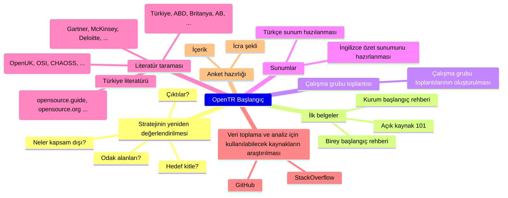

---
title: "2023 yılı 2. Çalışma Dönemi"
linkTitle: "2023 2. Dönem"
weight: 1
description: >
  [Temmuz 2023 - Aralık 2023]
---

Bu dönemde OpenTR'nin mevcut teknik altyapısı kullanılarak içerik üretimi ve yayınlanması sağlanacaktır. Çekirdek
kadro ile strateji yeniden değerlendirilecek ve ilk belgeler oluşturulacaktır.

## Dönem Hedefleri

* Stratejinin çekirdek kadro ile birlikte yeniden değerlendirilmesi
* İlk "geçici" strateji belgelerin oluşturulması
  * Birey başlangıç rehberi
  * Kurum başlangıç rehberi
* Açık kaynak tanıtımı belgeleri
* Düzenli çalışma grubu toplantılarının oluşturulması
* Türkçe sunum hazılanması
* İngilizce özet sunumunu hazırlanması
* Literatür taraması
* Veri toplama ve analiz için kullanılabilecek kaynakların araştırılması
* Anket için çalışma başlatılması

Dönem çalışmalarını GitHub projesinde görebilir ve katkıda bulunabilirsiniz: https://github.com/orgs/OpenTRFoundation/projects/1/views/1

## Dönem Kararları

* [Altuğ Bilgin Altıntaş](https://www.linkedin.com/in/altuga/) ve [Müge Şahin](https://www.linkedin.com/in/m%C3%BCge-%C5%9Fahin-kocahan-4ab85173/) OpenTR çekirdek ekibinde gönüllü olarak çalışmaya başlamışlardır.
* Çekirdek kadro ilk toplantısını kapalı olarak gerçekleştirmiştir. Gelecek toplantılar açık olarak gerçekleştirilecektir.
* "Açık veri" odak alanlarından çıkarılmıştır, ancak logo değiştirilmeyecektir.
* İlk strateji ve rehberlik belgeleri Türkiye açık kaynak ekosistemine ait veri olmaksızın hazırlanacaktır.

## Dönem Raporu

Dönem sonunda yayınlanacaktır.
