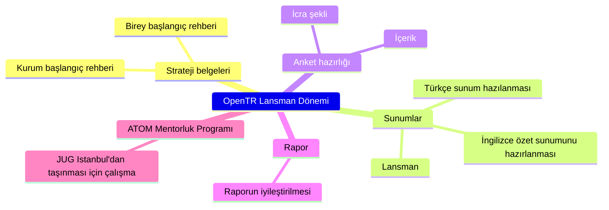

---
title: "2024 yılı 1. Çalışma Dönemi"
linkTitle: "2024 1. Dönem"
weight: 1
description: >
  [Ocak 2024 - Haziran 2024]
---

Bu dönemde OpenTR'nin lansmanı yapılacaktır. Ancak, lansmandan önce bazı hazırlıklar yapılması gerekmektedir.

## Dönem Hedefleri

* OpenTR'nin lansmanı (konferans, sosyal medya, vs.)
* "Geçici" strateji belgelerin oluşturulması
  * [Birey başlangıç rehberi](https://github.com/OpenTRFoundation/OpenTR/issues/14)
  * [Kurum başlangıç rehberi](https://github.com/OpenTRFoundation/OpenTR/issues/15)
* [Türkçe sunum hazılanması](https://github.com/OpenTRFoundation/OpenTR/issues/7)
* [İngilizce özet sunumunun hazırlanması](https://github.com/OpenTRFoundation/OpenTR/issues/8)
* [Anket için çalışma başlatılması](https://github.com/OpenTRFoundation/OpenTR/issues/19)
* "[Türkiye'de Açık Kaynağa Katkının Durumu](https://state.opentr.foundation/)" raporunun iyileştirilmesi
* ATOM Mentorluk Programı'nın JUG Istanbul'dan taşınması

Dönem çalışmalarını GitHub projesinde görebilir ve katkıda bulunabilirsiniz: https://github.com/orgs/OpenTRFoundation/projects/6/views/1

## Dönem Kararları

* JUG Istanbul'dan ATOM Mentorluk Programı'nın taşınması kararı alındı.
* OpenTR Lansmanı'nın Mayıs 2024'te yapılması kararı alındı.
* Strateji belgelerinin geçici olarak (anket yapılmadan) oluşturulması kararı alındı.
* Asenkron mentorluk programı için ileride çalışma başlatılması kararı alındı.

## Dönem Raporu

Dönem sonunda yayınlanacaktır.
