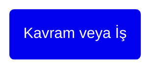

---
title: "Dönem belge şablonu"
linkTitle: "Dönem belge şablonu"
weight: 999
---

````markdown
---
title: "(Yıl) yılı (N). Çalışma Dönemi"
linkTitle: "(Yıl) (N). Dönem"
weight: 1
description: >
  [(Ay) (Yıl) - (Ay) (Yıl)]
---

## Dönem Özeti

(Hedef/yöntem/plan/çıktı özeti)

GitHub projesi: (GitHub projesi linki)

## Dönem Hedefleri

* (Hedef 1)
* (Hedef 2)



## Dönem Kararları

* (Karar 1)
* (Karar 2)

## Dönem Raporu

(Dönem raporu linki)

## Teşekkür

* (Kişi 1)
* (Kişi 2)
````
